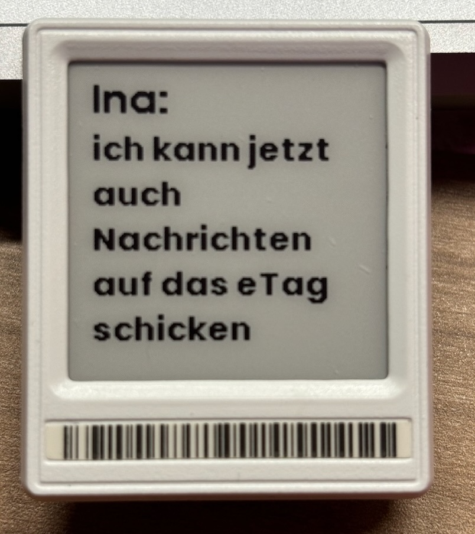

# OpenEPaperLinkHATagSources
Home assistant configs for Open ePaper Links

Depending on this project:
https://github.com/OpenEPaperLink/OpenEPaperLink/wiki

and this Homeassistant integration https://github.com/OpenEPaperLink/Home_Assistant_Integration

3D printable Tag Holder for 2,66" tag https://www.printables.com/model/1038666-266-epaper-tag-holder

