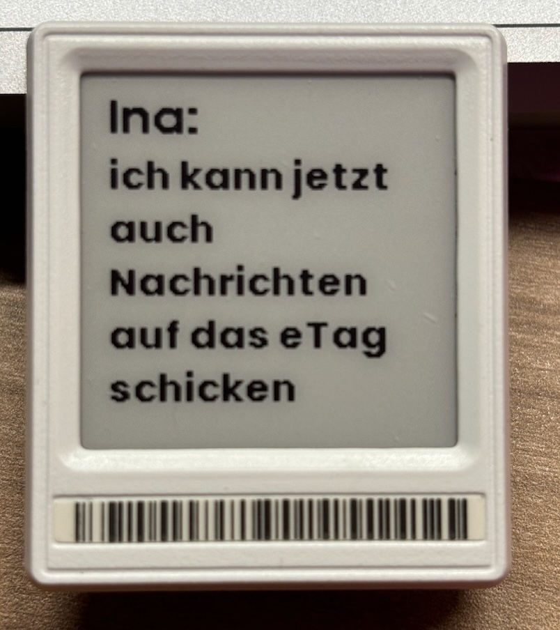

This automation displays the following data on an 1,56" display
* the Sender Name and 
* the message 

from a Telegram message which have been sent to a bot

Can be easily extended for bigger displays just change the x and y values and the max_width

Its using the blueprint from: https://github.com/marc-romu/home-assistant_blueprints

You need to change the entity_id and the telegram_bot name with your values

