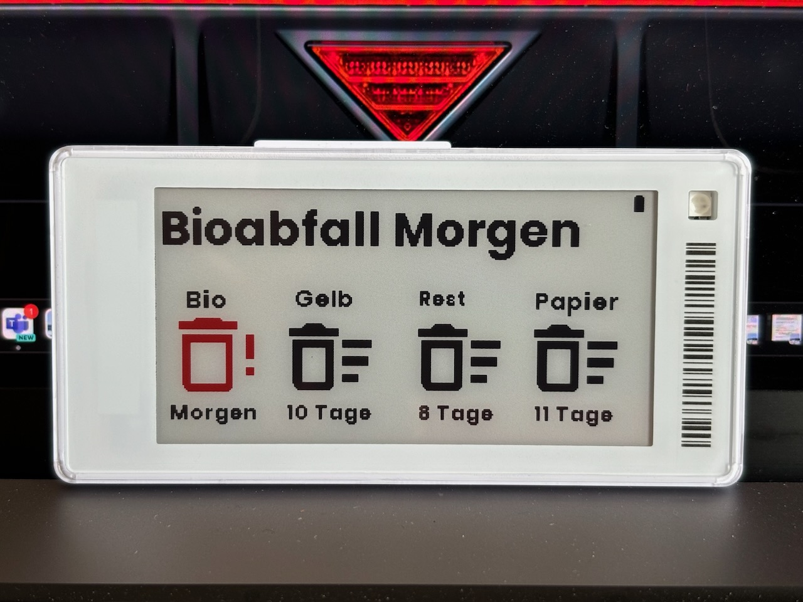

This automation displays the following data on an 2,66" display
* Information of the next collection
* Details for 4 different trash types

Its using the following integration to get the waste data: https://github.com/mampfes/hacs_waste_collection_schedule

You need to change the following values:
* entity_id (11)
* sensor (17)
* replace all occurrences of "sensor.tag266_2" with your tag name
* sensor.biomull (41 + 49) with the name of your sensor for the different waste containers 
  * including the extraction of the needed values, in my case it was e.g. "Bioabfall in x tagen" and Morgen
* needs to be done for all waste containers

